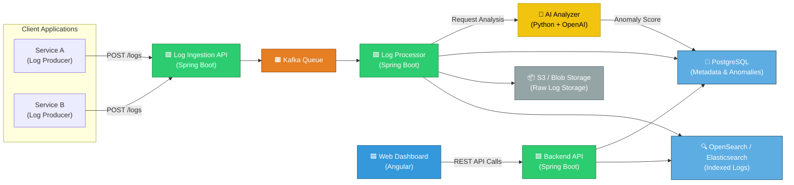

# .github

# Architecture

```mermaid

flowchart LR

    %% STYLE DEFINITIONS
    classDef spring fill:#2ecc71,stroke:#1e8449,color:#fff;
    classDef kafka fill:#e67e22,stroke:#a04000,color:#fff;
    classDef python fill:#f1c40f,stroke:#b7950b,color:#000;
    classDef angular fill:#3498db,stroke:#1f618d,color:#fff;
    classDef db fill:#5dade2,stroke:#154360,color:#fff;
    classDef storage fill:#95a5a6,stroke:#566573,color:#fff;

    %% COMPONENTS
    subgraph Apps["Client Applications"]
        A1["Service A\n(Log Producer)"]
        A2["Service B\n(Log Producer)"]
    end

    IN["🟩 Log Ingestion API\n(Spring Boot)"]:::spring
    Q["🟧 Kafka Queue"]:::kafka
    PROC["🟩 Log Processor\n(Spring Boot)"]:::spring
    AI["🐍 AI Analyzer\n(Python + OpenAI)"]:::python

    META["🐘 PostgreSQL\n(Metadata & Anomalies)"]:::db
    LOGDB["🔍 OpenSearch / Elasticsearch\n(Indexed Logs)"]:::db
    RAW["📦 S3 / Blob Storage\n(Raw Log Storage)"]:::storage

    API["🟩 Backend API\n(Spring Boot)"]:::spring
    FE["🟦 Web Dashboard\n(Angular)"]:::angular

    %% FLOWS
    A1 -->|POST /logs| IN
    A2 -->|POST /logs| IN

    IN --> Q
    Q --> PROC

    PROC --> LOGDB
    PROC --> RAW
    PROC --> META

    PROC -->|Request Analysis| AI
    AI -->|Anomaly Score| META

    API --> LOGDB
    API --> META

    FE -->|REST API Calls| API
```
